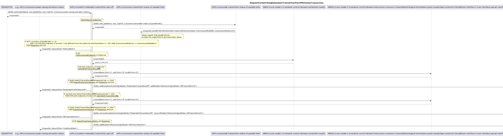
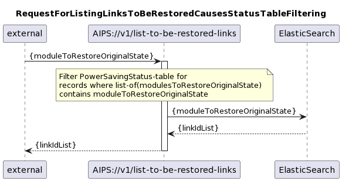

## Overview of modules in release v0.0.5
This section describes the set of modules covered by an upfront AIPS 0.0.5, which is exclusively for testing the most critical modules.  

#### Link related switching operation
AIPS v0.0.5 does contain two modules for link related switching operations.  
The **RedundantTransmittersOff** module switches both transmitters of one link off after ensuring that both transmitters of a parallel link are operating at their maximum modulation (means configured maximum, not hardware limitation).  
The RedundantTransmittersOff module that is included in AIPS v0.0.5 does not implement a topology dependent ordering, or any preparatory or clean-up actions. This also excludes any potentially required measures for suppressing alarms, respectively alarm notifications.  
A single attempt is taken, to reverse a partially executed transaction by switching the first transmitter back on, if the second one could not be deactivated.  
When processing is completed, the status of the link (e.g. "RedundantTransmittersOff") is reported to the requestor and to a central status documentation.  
The **AllTransmittersOn**  module switches both transmitters of the link on.  
The AllTransmittersOn module that is included in AIPS v0.0.5 does not implement a topology dependent ordering, or any preparatory or clean-up actions. This also excludes any potentially required measures for suppressing alarms, respectively alarm notifications.  
A single attempt is taken, to reverse a partially executed transaction by switching the first transmitter back off, if the second one could not be activated.  
When processing is completed, the status of the link (e.g. "AllTransmittersOn") is reported to the requestor and to a central status documentation. 

#### Link Analysis
AIPS v0.0.5 does include a link analysis module.  
The **BasicLinkAnalysis** module provides all necessary information for a switching operation on a protected, but not further differentiated link.  
The BasicLinkAnalysis needs the operator's Link-ID as an input.  
It returns the interfaceStatus, transmissionModeMax and transmissionModeCur of all parallel AirLayer connections.  
If it could not read the complete set of data from both devices (i.e. link endpoints) of any parallel link, it returns an error.  

The BasicLinkAnalysis module relies on network inventory information being provided by the MicroWaveDeviceInventory:
- it does not need to translate the link-ID into the UUID of an AirLayer connection, as they are identical by requirement
- for a given link it also fetches the mount names, UUIDs, and local IDs of the AirInterfaces that terminate the AirLayer connection from the MWDI
- it also fetches information about parallel links from the MWDI

#### Power saving status
AIPS v0.0.5 does include the ActivationStatus module for centralized documentation of the power saving status.  
The **BasicPowerSavingStatus** module documents and provides information about the individual link's status in regards of power saving.  
The link related switching operation modules RedundantTransmittersOff and AllTransmittersOn are sending status information at the end of their configuration activity.  
This information is stored and provided either for the individual link or filtered for a specific status (e.g. "normalOperation", "redundantTransmittersOff").  

## Diagrams for the AIPS v0.0.5 Release

### 05 Link related switching operation
.  
.  
  
.  
.  
  
.  
.  
### 06 Link Analysis
  
.  
.  
### 07 Power Saving Status
  
.  
.  
  
.  
.  
  
.  
.  
  
.  
.  
  
.  
.  
  
.  
.  
