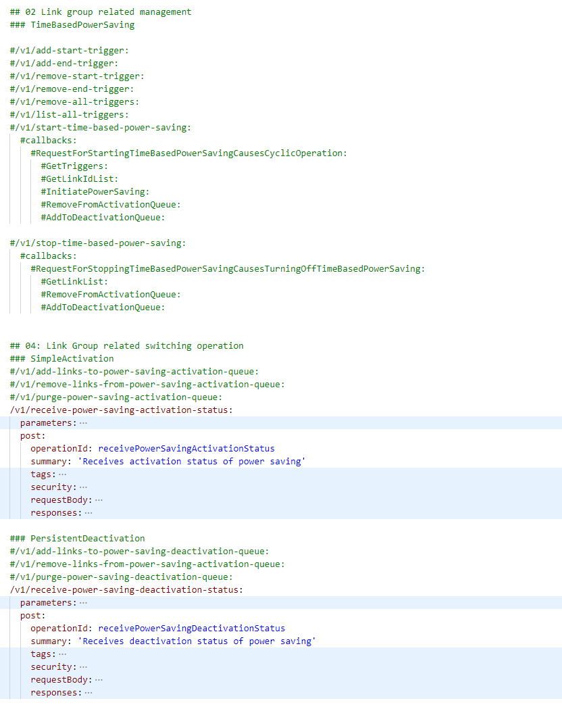
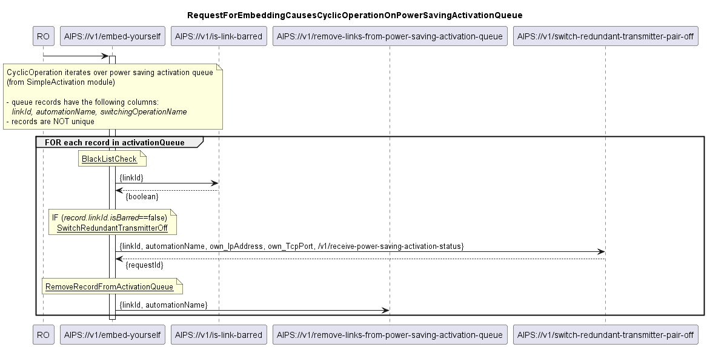
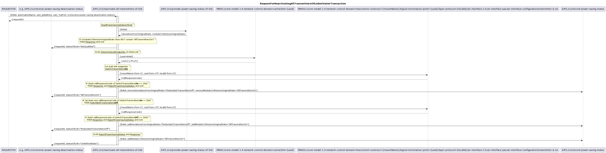
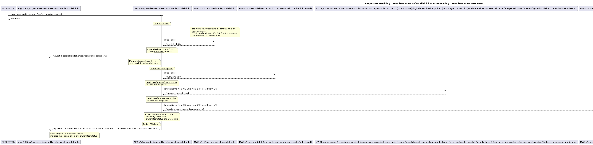

## Overview of modules in release v0.0.9
This section describes the set of modules covered by an upfront AIPS 0.0.9, which is again exclusively for testing.  

Changes between 0.0.5 and 0.0.9 on module level:  
| **Module Category**                       | **AIPS 0.0.5**                                         | **AIPS 0.0.9**                                                 |
|-------------------------------------------|--------------------------------------------------------|----------------------------------------------------------------|
| Application Pattern                       | AP 2.0.1                                               | AP 2.1.0                                                       |
| 01 Automation management                  |                                                        | StaticListAutomationManagement 0.0.9  BlackListManagement 0.0.9 |
| 02 Link group related automation          |                                                        | TimeBasedPowerSaving 0.0.9                                     |
| 03 Link related automation                |                                                        |                                                                |
| 04 Link group related switching operation |                                                        | SimpleActivation 0.0.9  PersistentDeactivation 0.0.9       |
| 05 Link related switching operation       | RedundantTransmittersOff 0.0.5  AllTransmittersOn 0.0.5 | RedundantTransmittersOff 0.0.5  AllTransmittersOn 0.0.5 |
| 06 Link analysis                          | BasicLinkAnalysis 0.0.5                                | BasicLinkAnalysis 0.0.5                                        |
| 07 Power saving status                    | BasicPowerSavingStatus 0.0.5                           | BasicPowerSavingStatus 0.0.5                                   |
| 08 Logging of power saving                |                                                        |                                                                |
| 09 Performance of power savings           |                                                        |                                                                |
| 10 Alarm management of power savings      |                                                        |                                                                

.  

The following excerpt of the OAS describes the existing services and callbacks (black) and the ones that get added with the 0.0.9 release (commented in green).  

  
  
  

#### Automation management
Starting with AIPS v0.0.9, two simple modules for automation management are contained.  
The **StaticListAutomationManagement** module is reading a list of links from the file system and allows to assignment none, one or several kinds of automation to the individual link.  
Information about assigned kinds of automation can be retrieved for an individual link or all links can be filtered for being assigned to a specific automation.  
Links can be assigned to an automation individually or in groups.  
The resulting list is again saved to the file system.  
The **BlackListManagement** module is reading a list of links from the file system, for which switching into power saving mode is not allowed. 
Adding a link to the blacklist does not affect the assigned automationNames in the static list, but as soon as the link is blacklisted, a currently active power saving needs to be turned off. 
Once the link is deleted again from the blacklist, power saving mode changes as configured in the static list can be carried out again. It is also possible to add a list of multiple links.  
The resulting list is again saved to the file system.  

#### Link group related automation
Starting with AIPS v0.0.9, one module for link group related automation is included.  
The **TimeBasedPowerSaving** module is intended to turn power saving on and off for link groups at specified times.  
The time would be the input parameter to be monitored.  
The module allows defining multiple trigger times of trigger type StartPowerSaving or RestoreFullCapacity.  
The trigger times are individually defined and stored into instances of StringProfile.  
The trigger times can either individually or all together be deleted.  
Depending on the type of trigger reached, either the SimpleActivation or the PersistentDeactivation module will be activated.  

#### Link group related switching operation
Starting with AIPS v0.0.9, two modules for link group related switching operations are covered (in AIPS v0.0.5 rudimentary implementations of two receive services were included for testing purposes).  
The **SimpleActivation** module implements a simple algorithm for activating the power saving mode on a very large group of undifferentiated links. 
It receives a list of Link-IDs from the TimeBasedPowerSaving module and activates the RedundantTransmittersOff module sequentially for each Link-ID in this list.  
There is no retry in case of failure.  
The **PersistentDeactivation** module implements an algorithm that persistently tries to bring all links back to the original mode.  
It also receives a list of Link-IDs from the TimeBasedPowerSaving module.  
In a first step, it loads link status information from the BasicPowerSavingStatus module and removes all links that are not operating in any power saving mode from the list of Link-IDs. 
After that, it activates the AllTransmittersOn module sequentially for every Link-ID in this list.  
Every time the AllTransmittersOn module returns that the link's transmitters are switched on, the PersistentDeactivation module removes the Link-ID from the list.  
After reaching the end of the list of links, the PersistentDeactivation module waits for a configurable number of minutes before it starts making another attempt on the rest of the links on the list.  
The maximum runtime of the module must be configured.  

#### Link related switching operation
Already in AIPS v0.0.5, two modules for link related switching operations were included.  
The **RedundantTransmittersOff** module switches both transmitters of one link off after ensuring that both transmitters of a parallel link are operating at their maximum modulation (means configured maximum, not hardware limitation).  
The RedundantTransmittersOff module that is included in AIPS v0.0.5 does not implement a topology dependent ordering, or any preparatory or clean-up actions. This also excludes any potentially required measures for suppressing alarms, respectively alarm notifications.  
A single attempt is taken, to reverse a partially executed transaction by switching the first transmitter back on, if the second one could not be deactivated.  
When processing is completed, the status of the link (e.g. "RedundantTransmittersOff") is reported to the requestor and to a central status documentation.  
The **AllTransmittersOn**  module switches both transmitters of the link on.  
The AllTransmittersOn module that is included in AIPS v0.0.5 does not implement a topology dependent ordering, or any preparatory or clean-up actions. This also excludes any potentially required measures for suppressing alarms, respectively alarm notifications.  
A single attempt is taken, to reverse a partially executed transaction by switching the first transmitter back off, if the second one could not be activated.  
When processing is completed, the status of the link (e.g. "AllTransmittersOn") is reported to the requestor and to a central status documentation. 

#### Link Analysis
Already in AIPS v0.0.5, a link analysis module was included.  
The **BasicLinkAnalysis** module provides all necessary information for a switching operation on a protected, but not further differentiated link.  
The BasicLinkAnalysis needs the operator's Link-ID as an input.  
It returns the interfaceStatus, transmissionModeMax and transmissionModeCur of all parallel AirLayer connections.  
If it could not read the complete set of data from both devices (i.e. link endpoints) of any parallel link, it returns an error.  

The BasicLinkAnalysis module relies on network inventory information being provided by the MicroWaveDeviceInventory:
- it does not need to translate the link-ID into the UUID of an AirLayer connection, as they are identical by requirement
- for a given link it also fetches the mount names, UUIDs, and local IDs of the AirInterfaces that terminate the AirLayer connection from the MWDI
- it also fetches information about parallel links from the MWDI

#### Power saving status
Already in AIPS v0.0.5, an ActivationStatus module for centralized documentation of the power saving status was included.  
The **BasicPowerSavingStatus** module documents and provides information about the individual link's status in regards of power saving.  
The link related switching operation modules RedundantTransmittersOff and AllTransmittersOn are sending status information at the end of their configuration activity.  
This information is stored and provided either for the individual link or filtered for a specific status (e.g. "normalOperation", "redundantTransmittersOff").  

## Diagrams for the AIPS v0.0.9 Release

### 01 Automation management
  
.  
.  
  
.  
.  
  
.  
.  
  
.  
.  
  
.  
.  
  
.  
.  
  
.  
.  
  
.  
.  
  
.  
.  
  
.  
.  
  
.  
.  
  
.  
.  
  
.  
.  
  
.  
.  
  
.  
.  
### 02 Link group related automation
.  
.  
  
.  
.  
  
.  
.  
  
.  
.  
  
.  
.  
  
.  
.  
  
.  
.  
  
.  
.  
  
.  
.  
### 04 Link group related switching operation
.  
.  
  
.  
.  
  
.  
.  
  
.  
.  
  
.  
.  
  
.  
.  
@startuml 410_addLinksToPersistentDeactivationQueue
  
.  
.  
  
.  
.  
  
.  
.  
  
.  
.  
### 05 Link related switching operation
.  
.  
  
.  
.  
  
.  
.  
### 06 Link analysis
  
.  
.  
### 07 Power saving status
  
.  
.  
  
.  
.  
  
.  
.  
  
.  
.  
  
.  
.  
  
.  
.  
