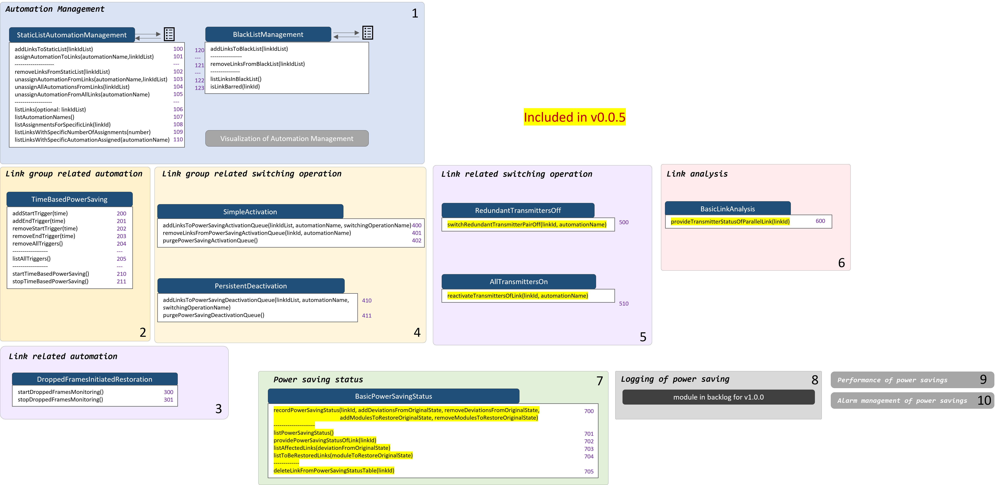
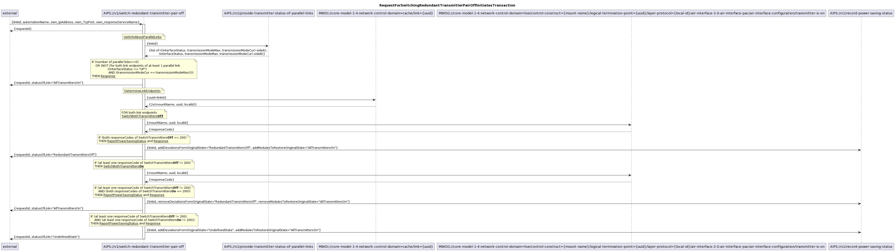
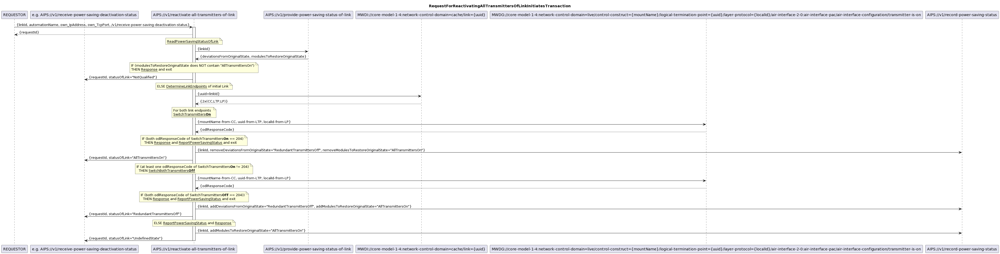
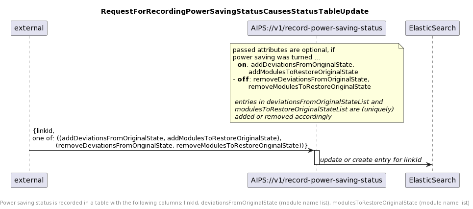
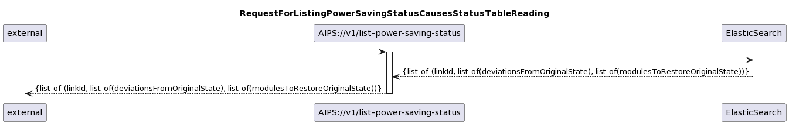
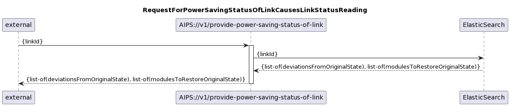
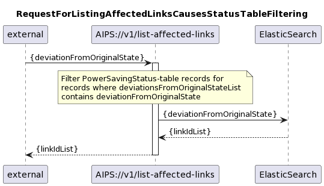
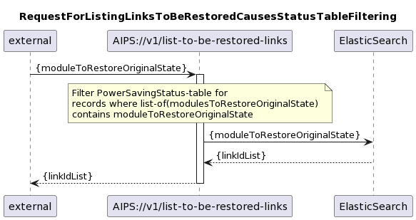
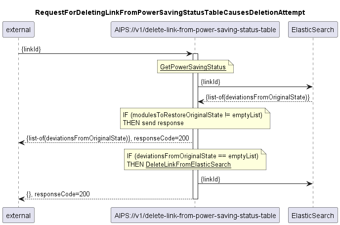

## Structure of the AirInterfacePowerSaver

The tasks to be performed by the AirInterfacePowerSaver can be divided into several module types.
Not every module type has to be implemented from the beginning.
In many cases modules of the different module types can be added or removed flexibly.
In some cases it even makes sense to run several modules of the same type in parallel as part of a continuous optimization.

The interfaces between the modules are provided on the API of the AirInterfacePowerSaver.
Thus, the respective functions can also be used or replaced by other applications.
This also serves to prepare for integration with proprietary functions implemented decentrally on the devices or in 3rd party software.

### Module types
This section describes a structuring of function into modules.
It categorizes the function as it is planned to be implemented in multiple releases of the AIPS.

#### Management of automations
Switching operations are performed in the same way on many links.
However, the total of all links might be divided into several subgroups that experience different kinds of automation.
In a list of all links, the individual links are assigned none, one or more kinds of automation.  
Visualization of automation management: editing the list of all links is supported by a GUI.

#### Link group related automation
Enabling and disabling of the power saving mode is controlled for whole groups of links by this type of module.
The purpose of this type of module is monitoring input parameters for the occurrence of a predefined event and triggering a link group related switching operation.
Example: At 2 a.m., the activation of the power saving mode is triggered on all links of the group.

#### Link related automation
This type of module activates or deactivates the power saving mode for individual links.
One or several input parameters get monitored for the occurrence of a predefined event. Eventually a link related switching operation gets triggered.
It seems to be likely that one or several link related automation modules will be assigned in parallel to a link group related automation to an individual link in future.
E.g., a time based link group related automation might be combined with a link related automation that is monitoring packet loss or degradation of the operated modulation.

#### Link group related switching operation
Once a switchover is triggered by a link group related automation module, the task must be broken down into link related switching operations.
Is the switchover triggered on all links of the group at the same time or one after the other? Is the sliding window approach required to execute a configurable number of switchovers in parallel?
Get links that could not be successfully switched at the first attempt addressed again? If yes, how often or how long?
Does the group of links that are to be switched break down into subgroups that need to be handled by different link related switching operations (e.g., by vendor)?

#### Link related switching operation
Once a link switchover has been triggered, it must be broken down into configuration steps on the affected devices.
The individual implementation of the link related switching operation controls which attributes are to be changed, in which order this is to be done, and whether preparatory and clean-up actions (e.g., deactivation/activation of alarm notifications) are required.
The link related switching operation also manages the entire transaction, which might involve e.g. a roll-back in case the sequence of configuration steps could only be partially implemented (e.g. on only one of the two devices).
When processing is complete, the status of the link is reported to the requestor, to a central status documentation, and to the switching operation logging.
An undesired end state is reported to a central alarm management system. 

#### Link Analysis
The link analysis modules support the link related switching operation modules by providing details about the link and its endpoints.
The request has to contain a Link-ID and it returns
 - the identification of the termination points,
 - all necessary data to evaluate whether the link is qualified for the power saving mode and to configure the changes
 - and the identification of a parallel link and its termination points, if there is one.

#### Power saving status
Information about which links are currently in power saving mode is centrally documented and made available.
Information on individual links or lists filtered by status are made available to other applications or for analysis.

#### Power saving logging
Information about when and on which link a switching operation was triggered and whether it was completed successfully is centrally documented and made available.
Historical information on individual links or lists filtered by event type (e.g., failed shutdown) are made available for other applications or analysis.

#### Power saving performance
The documented switching events are evaluated for savings, number events and other aspects.
Savings are calculated based on an assumed electricity price.
The number of successful and unsuccessful switching events is compared.

#### Alarm management of the power saver
Alarms reported by the individual modules are documented and can be read at a central location.
Subscribing for alarm notifications is supported, too.

## Overview of modules in release v0.0.5
This section describes the set of modules covered by an upfront AIPS 0.0.5, which is exclusively for testing the most critical modules.  

#### Link related switching operation
AIPS v0.0.5 does contain two modules for link related switching operations.
The **RedundantTransmittersOff** module switches both transmitters of one link off after ensuring that both transmitters of a parallel link are operating at their maximum modulation (means configured maximum, not hardware limitation).
The RedundantTransmittersOff module that is included in AIPS v0.0.5 does not implement a topology dependent ordering, or any preparatory or clean-up actions. This also excludes any potentially required measures for suppressing alarms, respectively alarm notifications.
A single attempt is taken, to reverse a partially executed transaction by switching the first transmitter back on, if the second one could not be deactivated.
When processing is completed, the status of the link (e.g. "RedundantTransmittersOff") is reported to the requestor and to a central status documentation. 
The **AllTransmittersOn**  module switches both transmitters of the link on.
The AllTransmittersOn module that is included in AIPS v0.0.5 does not implement a topology dependent ordering, or any preparatory or clean-up actions. This also excludes any potentially required measures for suppressing alarms, respectively alarm notifications.
A single attempt is taken, to reverse a partially executed transaction by switching the first transmitter back off, if the second one could not be activated.
When processing is completed, the status of the link (e.g. "AllTransmittersOn") is reported to the requestor and to a central status documentation. 

#### Link Analysis
AIPS v0.0.5 does include a link analysis module.
The **BasicLinkAnalysis** module provides all necessary information for a switching operation on a protected, but not further differentiated link.
The BasicLinkAnalysis needs the operator's Link-ID as an input.
It returns the interfaceStatus, transmissionModeMax and transmissionModeCur of all parallel AirLayer connection.
If it could not read the complete set of data from both devices (i.e. link endpoints) of any parallel link, it returns an error.

The BasicLinkAnalysis module relies on network inventory information being provided by the MicroWaveDeviceInventory:
- it does not need to translate the link-ID into the UUID of an AirLayer connection, as they are identical by requirement
- for a given link it also fetches the mount names, UUIDs, and local IDs of the AirInterfaces that terminate the AirLayer connection from the MWDI
- it also fetches information about parallel links from the MWDI

#### Power saving status
AIPS v0.0.5 does include the ActivationStatus module for centralized documentation of the power saving status.
The **BasicPowerSavingStatus** module documents and provides information about the individual link's status in regards of power saving.
The link related switching operation modules RedundantTransmittersOff and AllTransmittersOn are sending status information at the end of their configuration activity.
This information is stored and provided either for the individual link or filtered for a specific status (e.g. "normalOperation", "redundantTransmittersOff").

## Overview of modules in release v1.0.0
This section describes the set function covered by AIPS v1.0.0.

#### Automation management
AIPS v1.0.0 does contain two simple modules for automation management.  
The **StaticListAutomationManagement** module is reading a list of links from the file system and allows to assignment none, one or several kinds of automation to the individual link.
Information about assigned kinds of automation can be retrieved for an individual link or all links can be filtered for being assigned to a specific automation.
Links can be assigned to an automation individually or in groups.
The resulting list is again saved to the file system.  
The **BlackListManagement** module is reading a list of links from the file system, for which switching into power saving mode is not allowed. 
Adding a link to the blacklist does not affect the assigned automationNames in the static list, but as soon as the link is blacklisted, a currently active power saving needs to be turned off. 
Once the link is deleted again from the blacklist, power saving mode changes as configured in the static list can be carried out again. It is also possible to add a list of multiple links.
The resulting list is again saved to the file system.  

Later versions of the automation management will also contain a module for visualizing the automation management.
The list of links, respectively the assignment of automations need to be managed via the REST interface.

#### Link group related automation
AIPS v1.0.0 does contain one module for link group related automation.
The **TimeBasedPowerSaving** module is intended to turn power saving on and off for link groups at specified times.
The time would be the input parameter to be monitored.
The module allows defining multiple trigger times of trigger type StartPowerSaving or RestoreFullCapacity.
The trigger times are individually defined and stored into instances of StringProfile.
The trigger times can either individually or all together be deleted.
Depending on the type of trigger reached, either the SimpleActivation or the PersistentDeactivation module will be activated.

#### Link related automation
AIPS v1.0.0 does not contain this type of module.

#### Link group related switching operation
AIPS v1.0.0 does include two modules for link group related switching operations.
The **SimpleActivation** module implements a simple algorithm for activating the power saving mode on a very large group of undifferentiated links. 
It receives a list of Link-IDs from the TimeBasedPowerSaving module and activates the RedundantTransmittersOff module sequentially for each Link-ID in this list.
There is no retry in case of failure.  
The **PersistentDeactivation** module implements an algorithm that persistently tries to bring all links back to the original mode.
It also receives a list of Link-IDs from the TimeBasedPowerSaving module.
In a first step, it loads link status information from the BasicPowerSavingStatus module and removes all links that are not operating in any power saving mode from the list of Link-IDs. 
After that, it activates the AllTransmittersOn module sequentially for every Link-ID in this list.
Every time the AllTransmittersOn module returns that the link's transmitters are switched on, the PersistentDeactivation module removes the Link-ID from the list.
After reaching the end of the list of links, the PersistentDeactivation module waits for a configurable number of minutes before it starts making another attempt on the rest of the links on the list.
The maximum runtime of the module must be configured.

#### Power saving logging
AIPS v1.0.0 does not include this type of module.

#### Power saving performance
AIPS v1.0.0 does not include this type of module.

#### Alarm management of the power saver
AIPS v1.0.0 does not contain this type of module.

## Diagrams for the AIPS v0.0.5 Release
### 05 Link related switching operation
.  
.  
  
.  
.  
  
.  
.  
### 06 Link Analysis
  
.  
.  
### 07 Power Saving Status
  
.  
.  
  
.  
.  
  
.  
.  
  
.  
.  
  
.  
.  
  
.  
.  
